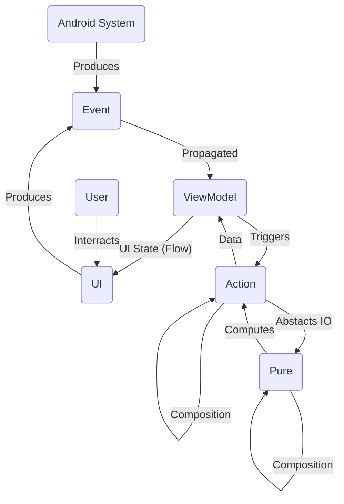
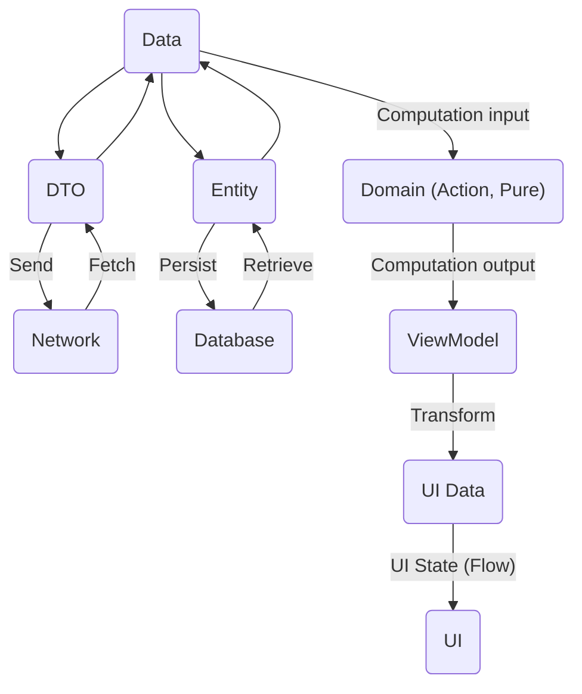
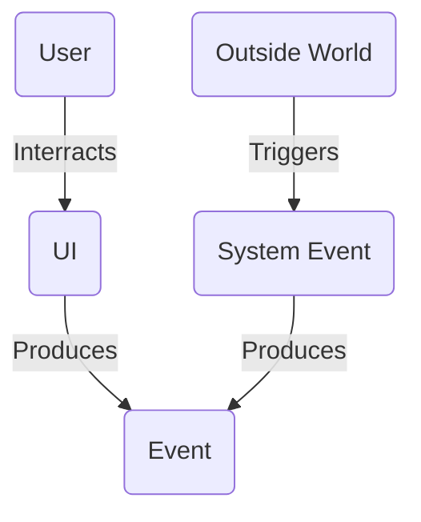
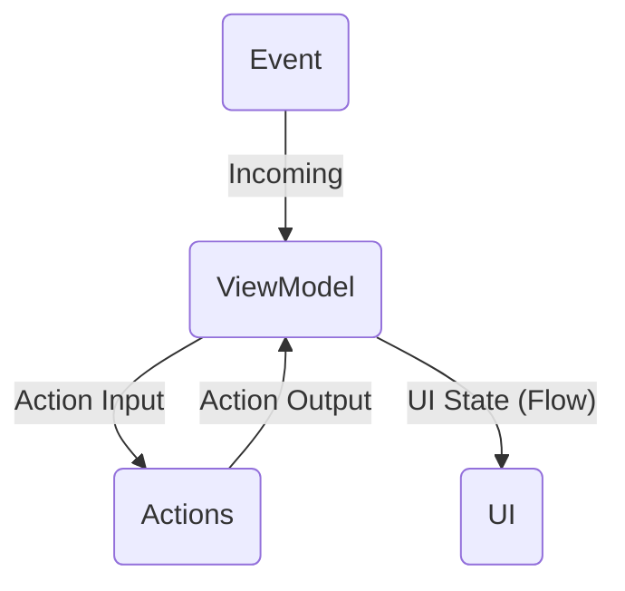
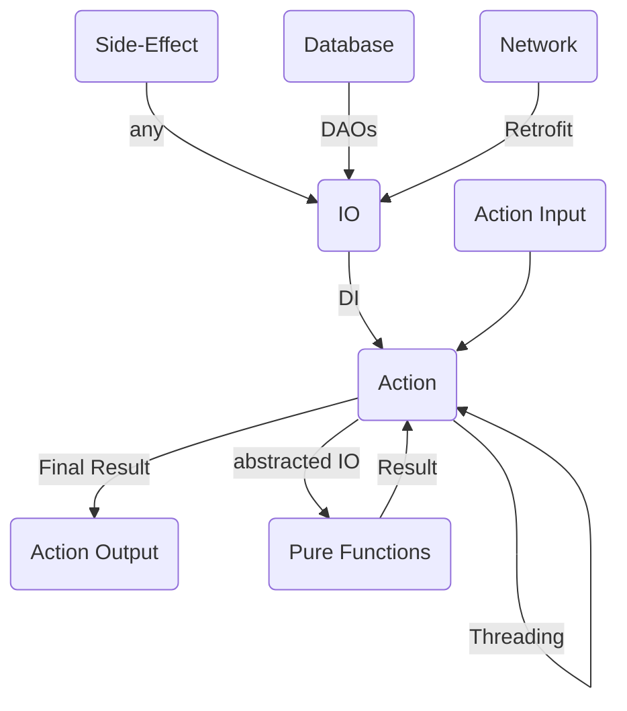
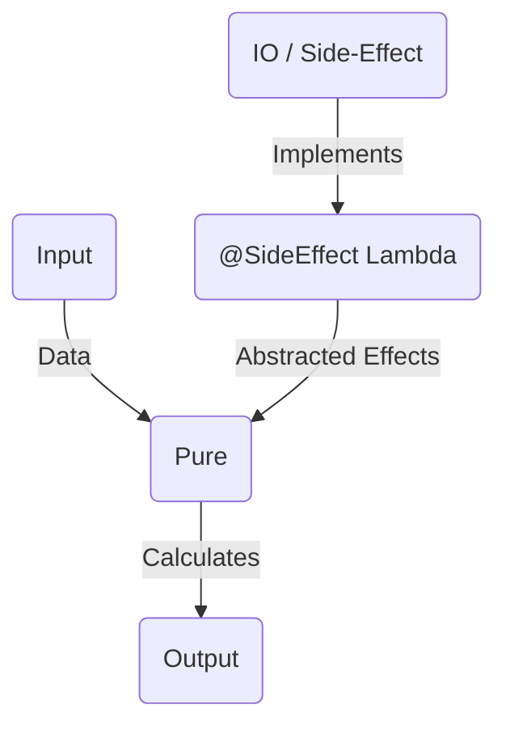
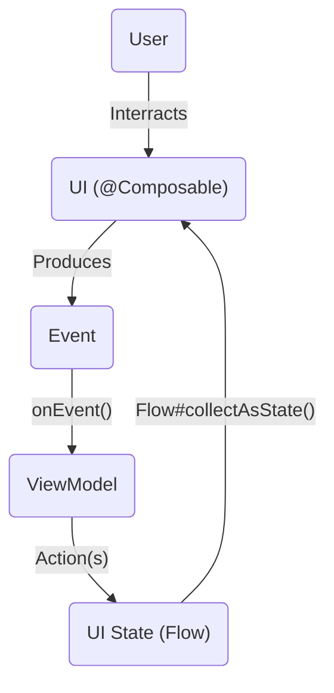

# Ivy Developer Guidelines

## _:warning: WARNING: This guidelines are deprecated and obsoloete. Ignore this and go to **[docs/architecture](architecture/)** :warning:_

A short guide _(that'll evolve with time)_ with one and only goal - to **make us better developers.**

[](https://github.com/Ivy-Apps/ivy-wallet/blob/main/CONTRIBUTING.md)
[](https://t.me/+ETavgioAvWg4NThk)
[](https://t.me/+ETavgioAvWg4NThk)

> PRs and proposals for typos, better wording, better examples or minor edits are very welcome!

## Ivy Architecture (FRP)

The Ivy Architecture follows the Functional Reactive Programming (FRP) principles. A good example for them is [The Elm Architecture.](https://guide.elm-lang.org/architecture/)

### Motivation

- Organize code _(Scalability)_
- Reduce complexity _(Separation of responsibility)_
- Reuse code (Composability)
- Limit side-effects _(Less bugs)_
- Easier testing _(Pure, Controlled Effects, UI)_
- Easier refactoring _(Strongly Typed)_

### Architecture graph



### Resources _(further learning)_

- [The Android Architecture](https://www.youtube.com/watch?v=TPWmfJq16rA&list=PLWz5rJ2EKKc8GZWCbUm3tBXKeqIi3rcVX)
- [Clean Code](https://www.oreilly.com/library/view/clean-code-a/9780136083238/)
- [Jetpack Compose Docs](https://developer.android.com/jetpack/compose/documentation)
- [Functional Programming](https://en.wikipedia.org/wiki/Functional_programming)
- [Category Theory for Programmers](https://github.com/hmemcpy/milewski-ctfp-pdf)
- [Functional Reactive Programming](https://www.youtube.com/watch?v=Agu6jipKfYw&t=1518s)
- [The Elm Architecture](https://guide.elm-lang.org/architecture/)
- [Maintainable Software Architecture with Haskell](https://www.youtube.com/watch?v=kIwd1D9m1gE)
- [The Dao of FP](https://github.com/BartoszMilewski/Publications/blob/master/TheDaoOfFP/DaoFP.pdf)
- [Don't walk away from complexity, run!](https://www.youtube.com/watch?v=4MEKu2TcEHM)
- [Lambda Calculus](https://www.youtube.com/watch?v=eis11j_iGMs)

### 0. Data Model

The Data Model in Ivy drives clear separation between `domain` pure data required for business logic w/o added complexity, `entity` database data, `dto` _(data transfer object)_ JSON representation for network requests and `ui` data which we'll displayed.

Learn more at [Android Developers Architecture: Entity](https://www.youtube.com/watch?v=cfak1jDKM_4).

#### Motivation

- Reduce complexity _(JSON, DB specifics are isolated)_
- Flexibility _(allows editing of Data object on different levels w/o breaking existing code)_
- Easier domain logic _(unnecessary fields are removed)_

#### Data Model



#### Example

- `DisplayTransaction`
  - UI specific fields
- `Transaction`
  - domain data
- `TransactionEntity`
  - has `isSynced`, `isDeletedFlags` db specific fields (Room DB annotations)
- `TransactionDTO`
  - exactly what the API expects/returns (JSON)

> Motivation: This separation **reduces complexity** and **provides flexibility** for changes.

### 1. Event (UI interaction or system)

The `Event` encapsulates outside world signals in an excepted format and abstracts user input and system events.

An `Event` is generated from either user interaction with the UI or a system subscription _(e.g. Screen start, Time, Random, Battery level)_.

#### Motivation

- Simplifies domain logic. _(Abstracts Input)_
- Makes ViewModel & Domain logic independent of Android & UI specifics. _(Dependency Inversion)_

#### Event Graph



> Note: There are infinite user inputs and outside world signals.

### 2. ViewModel (mediator)

Triggers `Action` for incoming `Event`, transforms the result to `UI State` and propagates it to the UI via `Flow`.

#### Motivation

- Domain logic & UI independent of each other. _(Dependency Inversion)_
- Defines the behavior for each UI and connects it with the corresponding domain logic.

#### ViewModel



### 3. Action (domain logic with side-effects)

Actions accept `Action Input`, handles `threading`, abstract `side-effects` (IO) and executes specific domain logic by **composing** `pure` functions or other `actions`.

#### Motivation

- Encapsulates domain logic.
- Make business operations (actions) re-usable. _(Composability)_
- Handles threading. _(Reduces Complexity)_
- Simplifies the ViewModel.
- Independent of UI State. _(Dependency Inversion)_
- Provide side-effects for the `pure` layer via Dependency Injection. _(DAOs, Retrofit, etc)_

#### Action Types

- `FPAction()`: declarative FP style _(preferable)_
- `Action()`: imperative OOP style

#### Action Graph



#### Action Composition Examples

##### Calculate Balance

```Kotlin
//Example 1: Calculates Ivy's balance
class CalcWalletBalanceAct @Inject constructor(
    private val accountsAct: AccountsAct,
    private val calcAccBalanceAct: CalcAccBalanceAct,
    private val exchangeAct: ExchangeAct,
) : FPAction<CalcWalletBalanceAct.Input, BigDecimal>() {

    override suspend fun Input.compose(): suspend () -> BigDecimal = recipe().fixUnit()

    private suspend fun Input.recipe(): suspend (Unit) -> BigDecimal =
        accountsAct thenFilter {
            withExcluded || it.includeInBalance
        } thenMap {
            calcAccBalanceAct(
                CalcAccBalanceAct.Input(
                    account = it,
                    range = range
                )
            )
        } thenMap {
            exchangeAct(
                ExchangeAct.Input(
                    data = ExchangeData(
                        baseCurrency = baseCurrency,
                        fromCurrency = (it.account.currency ?: baseCurrency).toOption(),
                        toCurrency = balanceCurrency
                    ),
                    amount = it.balance
                )
            )
        } thenSum {
            it.orNull() ?: BigDecimal.ZERO
        }

    data class Input(
        val baseCurrency: String,
        val balanceCurrency: String = baseCurrency,
        val range: ClosedTimeRange = ClosedTimeRange.allTimeIvy(),
        val withExcluded: Boolean = false
    )
}
```

##### Overdue Transactions

```Kotlin
//Example 2: Due transtions + due income/expense for a given filter
class DueTrnsInfoAct @Inject constructor(
    private val dueTrnsAct: DueTrnsAct,
    private val accountByIdAct: AccountByIdAct,
    private val exchangeAct: ExchangeAct
) : FPAction<DueTrnsInfoAct.Input, DueTrnsInfoAct.Output>() {

    override suspend fun Input.compose(): suspend () -> Output =
        suspend {
            range
        } then dueTrnsAct then { trns ->
            val dateNow = dateNowUTC()
            trns.filter {
                this.dueFilter(it, dateNow)
            }
        } then { dueTrns ->
            //We have due transactions in different currencies
            val exchangeArg = ExchangeTrnArgument(
                baseCurrency = baseCurrency,
                exchange = ::actInput then exchangeAct,
                getAccount = accountByIdAct.lambda()
            )

            Output(
                dueIncomeExpense = IncomeExpensePair(
                    income = sumTrns(
                        incomes(dueTrns),
                        ::exchangeInBaseCurrency,
                        exchangeArg
                    ),
                    expense = sumTrns(
                        expenses(dueTrns),
                        ::exchangeInBaseCurrency,
                        exchangeArg
                    )
                ),
                dueTrns = dueTrns
            )
        }

    data class Input(
        val range: ClosedTimeRange,
        val baseCurrency: String,
        val dueFilter: (Transaction, LocalDate) -> Boolean
    )

    data class Output(
        val dueIncomeExpense: IncomeExpensePair,
        val dueTrns: List<Transaction>
    )
}


//Example 3: Overdue transactions + their income/expense
class OverdueAct @Inject constructor(
    private val dueTrnsInfoAct: DueTrnsInfoAct
) : FPAction<OverdueAct.Input, OverdueAct.Output>() {

    override suspend fun Input.compose(): suspend () -> Output = suspend {
        DueTrnsInfoAct.Input(
            range = ClosedTimeRange(
                from = beginningOfIvyTime(),
                to = toRange
            ),
            baseCurrency = baseCurrency,
            dueFilter = ::isOverdue
        )
    } then dueTrnsInfoAct then {
        Output(
            overdue = it.dueIncomeExpense,
            overdueTrns = it.dueTrns
        )
    }

    data class Input(
        val toRange: LocalDateTime,
        val baseCurrency: String
    )

    data class Output(
        val overdue: IncomeExpensePair,
        val overdueTrns: List<Transaction>
    )
}
```

> `Actions` are very similar to the "use-cases" from the standard "Clean Code" architecture.

> Tip: You can compose actions and pure functions by using `then`, `thenMap`, `thenFilter`, `thenSum`.

> Tip: When creating an `Action` make it as **atomic** as possible. The goal of each `Action` is to do one thing **efficiently** and to be **composable** with other actions like LEGO.

### 4. Pure (domain logic, pure code)

The `pure` layer must consist of only pure functions without side-effects. If the business logic requires, **side-effects must be abstracted**.

#### Motivation

- Avoid code duplication in `Action(s)`. _(Composability)_ 
- Reduce complexity by abstracting domain logic from side-effects (DB, Network, etc) _(Effect-Based system)_
- Easier Unit Testing for the core domain logic.
- Enables Property-based Testing.

#### Function types

- **Partial**: not defined for all input values

    ```Kotlin
    @Partial(inCaseOf="b=0, produces ArithmeticException::class")
    fun divide(a: Int, b: Int) = a / b
    ```

- **Total**: defined for all input values but for the same input there is no guarantee to always return the same output (has side-effects)

    ```Kotlin
    //It's defined in all cases but with each call returns a different output
    
    fun timeNowUTC(): LocalDateTime = LocalDateTime.now(ZoneOffset.UTC)

    //Produces logging side-effect which can be seen in Logcat
    
    fun logMessage(
        msg: String
    ) {
        Log.d("DEBUG", msg) //SIDE-EFFECT!
    }
    ```

- **Pure**: defined for all input values and for the same input always returns the same result (has NO side-effects)

    ```Kotlin
    @Pure
    fun sum(a: Int, b: Int) = a + b

    @Pure
    fun logMessage(
        msg: String,

        @SideEffect
        log: (String) -> Unit
    ) {
        log("DEBUG: $msg")
    }
    ```

Each `@Pure` function must be **total** and its `@SideEffect`(s) if any abstracted.

> Rule: If a pure function is called with the **same input** and mocked side-effects it must always produce the **same output**.

#### Pure Graph



#### Code Example

```Kotlin
//domain.action (NOT PURE)
class ExchangeAct @Inject constructor(
    private val exchangeRateDao: ExchangeRateDao,
) : FPAction<ExchangeAct.Input, Option<BigDecimal>>() {
    override suspend fun Input.compose(): suspend () -> Option<BigDecimal> = suspend {
        exchange(
            data = data,
            amount = amount,
            getExchangeRate = exchangeRateDao::findByBaseCurrencyAndCurrency then {
                it?.toDomain()
            }
        )
    }

    data class Input(
        val data: ExchangeData,
        val amount: BigDecimal
    )
}


//domain.pure (PURE)
@Pure
suspend fun exchange(
    data: ExchangeData,
    amount: BigDecimal,

    @SideEffect
    getExchangeRate: suspend (baseCurrency: String, toCurrency: String) -> ExchangeRate?,
): Option<BigDecimal> {
  //PURE IMPLEMENTATION
  //....
}
```

> Tip: Make `pure` functions small, atomic and composable.

### 5. UI (@Composable)

Renders the `UI State` that the user sees, handles `user input` and transforms it to `events` which are propagated to the `ViewModel`. **Do NOT perform any business logic or computations.**

#### Motivation

- UI independent of logic.
- Transform UI State into UI on the screen.
- Abstracts the ViewModel from UI specifics.



> Exception: The UI layer may perform in-app `navigation().navigate(..)` to reduce boiler-plate and complexity.

### 6. IO (side-effects)

Responsible for the implementation of IO operations like persistence, network requests, randomness, date & time, etc.

#### Motivation

- Encapsulate IO effects. _(Reduce Complexity)_
- Abstracts `Action(s)` from IO implementation.
- Re-usable IO. _(Composability)_

#### Side-Effects

- **Room DB**, local persistence
- **Shared Preferences**, local persistence
  - key-value pairs persistence
  - _migrated to DataStore_
- **Retrofit**, Network Requests (REST)
  - send requests
  - parse response JSON with GSON
  - transform network errors to `NetworkException`
- **Randomness**
  - `UUID` generation
- **Date & Time**
  - current Date & Time (`timeNowUtc`, `dateNowUtc`)
  - Date & Time formatting using user's `Locale`

### 7. Android System (side-effects)

Responsible for the interaction with the Android System like launching `Intent`, sending `notification`, receiving `push messages`, `biometrics`, etc.

#### Motivation

- Abstracts `Action(s)` and `UI` from the Android System and its specifics. _(Reduce Complexity)_
- Re-usable Android System effects. _(Composability)_

---

## Testing

One of the reasons for the Ivy Architecture is to support painless, effective and efficient testing of the code base.

### Motivation

- Verifies whether the code works as expected before reaching manual QA. _(Stability)_
- Easier refactoring. _(Tests will protect us)_
- Faster and more reliable QA. _(Tests will ensure that the core functionality is working)_
- Instant feedback for Pull Requests. _(CI/CD)_

### Unit Testing

Tests whether the code is working correctly in the expected cases. _(hard-coded cases)_

#### Layers

- `Data Model`
- `Pure`

### Property-Based Testing

Tests correctness in unexpected cases by randomly generated test cases in a given range of possible input. _(auto-generated tests cases)_

#### Layers

- `Data Model`
- `Pure`

### End-to-end Android Tests

Tests the integration and correctness with the Android SDK & System on specific Android API version. _(end-to-end for logic)_

#### Layers

- `Action`
- `IO`
- `Android System`

### UI Android Tests

Tests everything from the perspective of a user using the UI. Imagine it like an automated QA going through pre-defined scenarios. _(end-to-end for everything)_

#### Layers

- `UI` (Compose)

---

_Version 1.3.2_

_Feedback and proposals are highly appreciated! Let's spark technical discussion and make Ivy and the Android World better! :rocket:_
