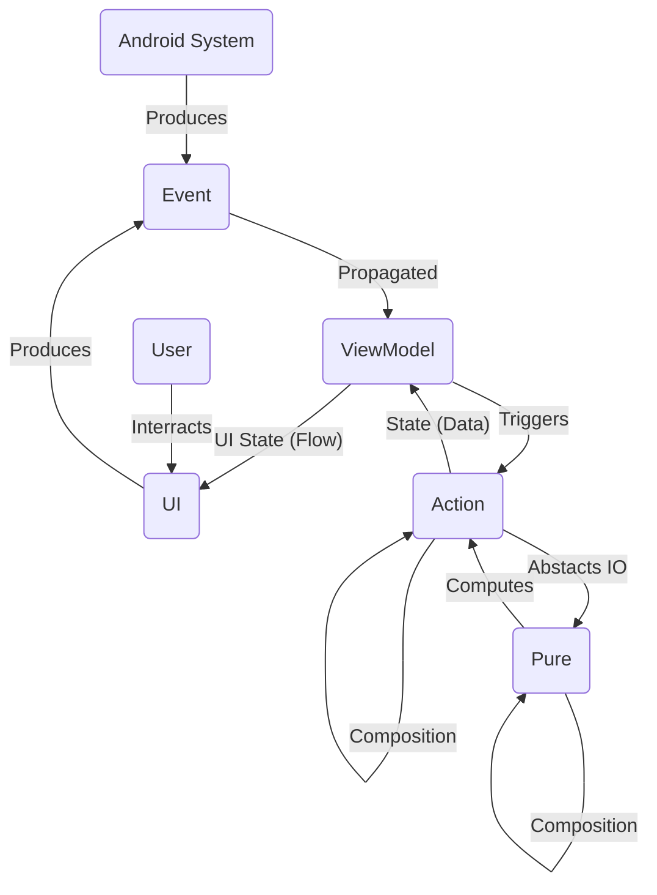
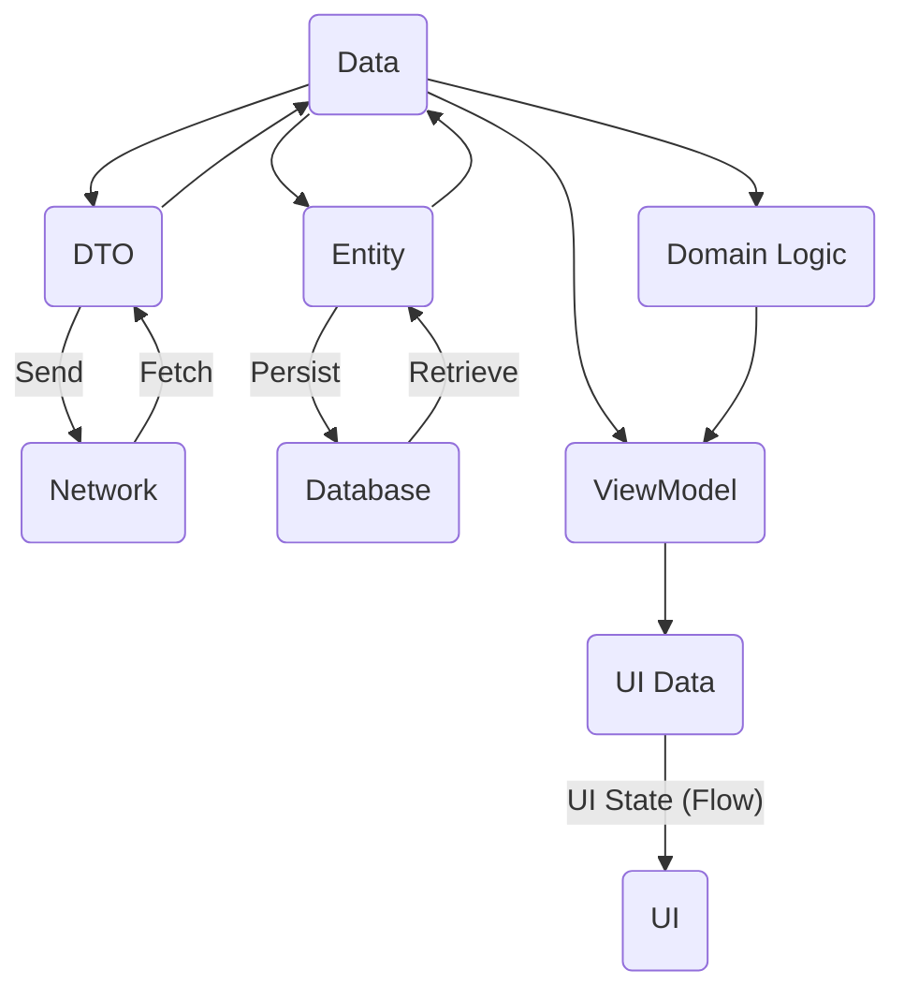

# Ivy Developer Guidelines

A short guide _(that'll evolve with time)_ with one and only goal - to make you a better developer.

> Feedback: Welcome!

> Proposals: Highly appreciated. :rocket:

## Ivy Architecture (FRP)

The Ivy Architecture follows the Functional Reactive Programming (FRP) principles. A good example for them is [The Elm Architecture.](https://guide.elm-lang.org/architecture/)

### Architecture graph

### 0. Data Model

The Data Model in Ivy drives clear separation between `domain` pure data required for business logic w/o added complexity, `entity` database data, `dto` _(data transfer object)_ JSON representation for network requests and `ui` data which we'll displayed.

**Data Model**

**Example**
- `DisplayTransaction`
  - UI specific fields
- `Transaction`
  - pure domain data
- `TransactionEntity`
  - has `isSynced`, `isDeletedFlags` db specific fields (Room DB anontations)
- `TransactionDTO`
  - exactly what the API expects/returns (JSON)

> Motivation: This separation **reduces complexity** and **provides flexibility** for changes.

### 1. Event (UI interaction or system)
An `Event` is generated from either user interaction with the UI or a system subscription _(e.g. Screen start, Time, Random, Battery level)_.

> Outside world signal -> Event

### 2. ViewModel (mediator)
Triggers `Actions` for incoming `Events`, transforms the result to `UI State` and propagates it to the UI via `Flow`.

> Event -> Action -> UI State

### 3. Action (domain logic with side-effects)

### 4. Pure (domain logic with pure code)

### 5. IO (side-effects)

Responsible for the implementation of IO operations like persistnece, network requests, randomness, date & time, etc.

- **Room DB**, local persistence
- **Shares Preferences**, local persistence
  - key-value pairs persistence
  - _will be migrated to DataStore_
- **Retrofit**, Network Requests (REST)
  - send requests
  - parse response JSON with GSON
  - transform network errors to `NetworkException`
- **Randomness**
  - `UUID` generation
- **Date & Time**
  - current Date & Time (`timeNowUtc`, `dateNowUtc`)
  - Date & Time formatting using user's `Locale`

---