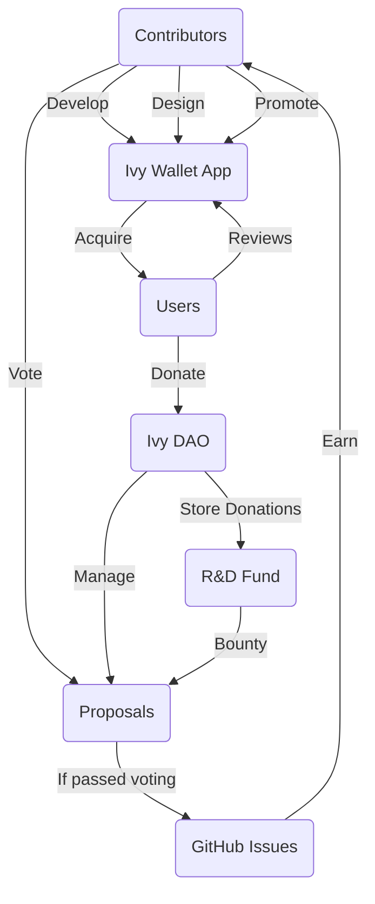

# Ivy DAO

## High-level picture

```mermaid
graph TD;
    contribs(Contributors)
    users(Users)
    dao(Ivy DAO)
    product(Ivy Wallet App)

    dao_dev_fund(R&D Fund)
    dao_proposals(Proposals)

    tickets(GitHub Issues)

    contribs -- Develop --> product
    contribs -- Design --> product
    contribs -- Promote --> product
    contribs -- Vote --> dao_proposals

    product -- Acquire --> users

    users -- Reviews --> product
    users -- Donate --> dao

    dao -- Store Donations --> dao_dev_fund
    dao -- Manage --> dao_proposals
    dao_dev_fund -- Bounty --> dao_proposals

    dao_proposals -- If passed voting --> tickets
    tickets -- Earn --> contribs
  
```