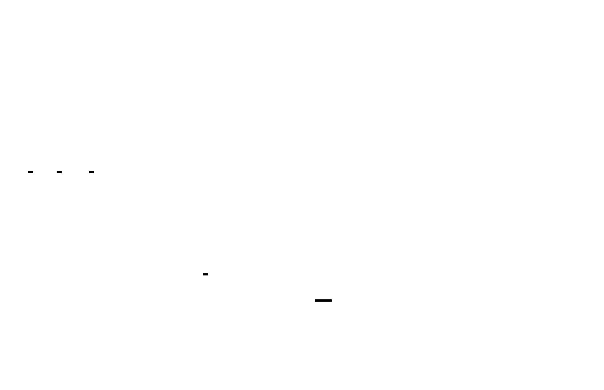

# Calc Algo

Calculates Income and Expense values in a given currency provided a list of transactions.

This algorithm is behind almost all numbers that you see in Ivy Wallet.


**[--> View the diagram full-screen <--](https://raw.githubusercontent.com/Ivy-Apps/ivy-wallet/develop/assets/calc_algo.svg)**

## Algorithm

Aggregates incomes and expenses in a given currency.
- Input: `[CalcTrn]` and an output currency
```kotlin
data class Input(
    val trns: List<CalcTrn>,
    val outputCurrency: CurrencyCode
)

data class CalcTrn(
    val amount: Double,
    val currency: Currency,
    val type: TransactionType,
) 
```
- Output: `RawStats`
```kotlin
data class RawStats(
    val incomes: Map<Currency, Double>,
    val expenses: Map<Currency, Double>,
    val incomesCount: Int,
    val expensesCount: Int,
)
```

### Steps

_(pseudo-code)_

**A) Raw Stats:** `O(# of trns) time | O(# of unique  currencies) space` `pure`

Aggregates transactions' income and expense by currency. The purpose is the result to be independant of the exchange rates and the base currency.

1. Initialization: `O(1) space-time`
```kotlin
val incomes = mutableMapOf<Currency, Double>()
val expenses = mutableMapOf<Currency, Double>()
var incomesCount = 0
var expensesCount = 0
```

2. Loop through transactions and aggregate: `O(# of trns) time | O(# of unique currencies) space`
```kotlin
trns.forEach {
    when(type) {
        Income -> {
            incomesCount++
            incomesMap[it.currency] += it.amount
        }
        Expense -> {
            expensesCount++
            expenses[it.currency] += it.amount
        }
    }
}
```

_Complexity: it iterates through each transaction (time) and creates a map key for each unique currency (space)._

**B) Get the exchange rates** `O(# of rates + # of overriden rates) space-time` `✨base-currency` `✨rates` `✨overriden-rates`

Retrieve from the local DB the latest exchange rates stored considering the ones that are manually overriden.

> RX: `✨X` means reacts to X

1. Retrieve the base currency from the DataStore: `O(1) space-time`
```kotlin
DataStore<Preferences>.preferrences.map { it[key] }
```

2. Retrieve all exchange rates from Room DB `O(# of rates) time | O(# of rates for the base currency) space` `✨base-currency`
```kotlin
@Query("SELECT currency, amount FROM exchange_rates WHERE baseCurrency = :baseCurrency")
    fun findAllByBaseCurrency(baseCurrency: String): Flow<List<Rate>>
```

3. Retrieve all manually overriden exchange rates from Room DB `O(# of overidden rates) space-time` `✨base-currnecy`

4. Replace automatic rates with the overriden ones `O(# of rates + # of overriden rates) time | O(# of rates + # of overriden rates) space` `✨rates` `✨overriden-rates`
```kotlin
combine(rates, overridenRates) {
    val res = mutableMapOf<Currency, Double>()
    rates.forEach {
        res[it.key] = it.value
    }
    overridenRates.forEach {
        res[it.key] = it.value
    }
    res
}
```


**C) Exchange RawStats** `O(# of unique currencies) time | O(1) space` `✨rates`

Exchange the aggregated incomes and expenses in different currencies from the `RawStats` into a single income and expense in the `outputCurrnecy` selected.

1. Initialization `O(1) space-time`
```kotlin
var incomeOutCurr = 0.0
var expenseOutCurr = 0.0
```

2. Iterate through `incomes: Map<Currency, Double>`, exchange in output curr and sum them `O(# of unique income currencies) time | O(1) space` `✨rates`
```kotlin
incomes.forEach { (curr, amount) ->
    incomOutCurr += exchange(rates, curr, amount, outputCurr)
}
```

> `exchange()` takes `O(1) space-time

3. Repeat Step 2. for `expesnes` `O(# of unique expense currencies) time | O(1) space` `✨rates`


## Complexity

The overall complexity of the "Calc" algorithm is the complexity of the steps performed.

**Steps:**
- **RawStats:** `O(# of trns) time | O(# of unique currencies)`
- **Exchange rates:** `O(# of rates + # of overriden rates) space-time`
- **Exchange in output currency**: `O(# of unique currencies) time | O(1) space`


### Conclusion
> **O(# of trns + # of rates + # of overriden rates) time**

>  **O(# of rates + # of overriden rates) space**

> Reacts to: `✨base-currency`, `✨rates`, `✨overriden-rates`

The practical cost of this algorithm is **`O(# of input trns + # of rates) time | O(# of rates) space`** because # of overriden rates << # of rates.