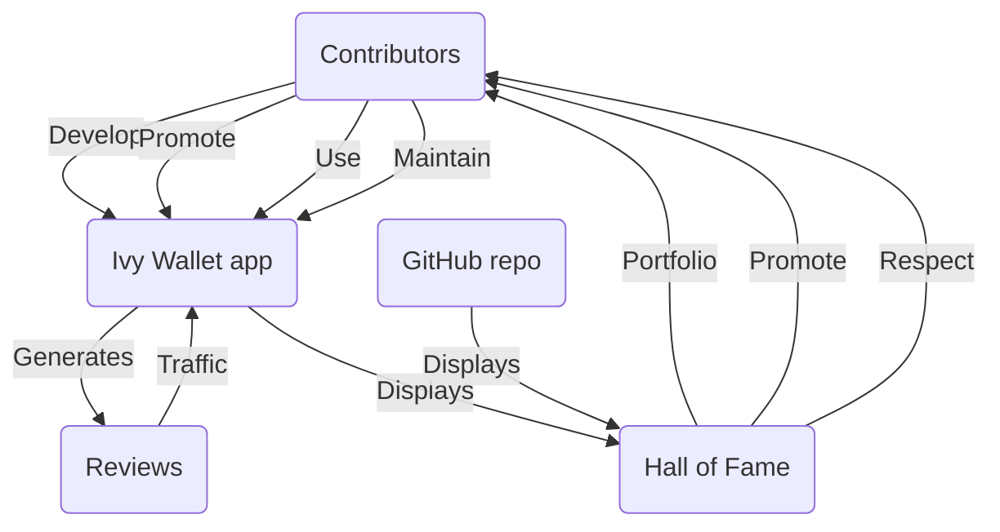

# Business Model

## :warning: WARNING: this model is deprecated. See [new model](../Ivy-Apps-Business-Model.md) :warning:

**:warning: Disclaimer: This business model isn't eternal and might evolve over time. So... We need your honest opinion to make it better!**

## Non-profit

For now, the model behind Ivy Wallet would be non-profit. A place to develop cool tech, use it to manage your money and also build a solid public portfolio on GitHub.

> In the near future, we might create an option in the app for PayPal donations. Donations will be used to pay the servers, Ivy's legal entity expenses and then distributed between founders and contributors.

### Goals
- Build a cool app to use ourselves.
- More users to become contributors and supporters to the project.
- Learn, design and develop cutting-edge Android technologies while doing something meaningful, not sample projects.
- Create a public portfolio that you can proudly present.
- Earn your place in the "Hall of Fame" and make Ivy Wallet better.
- The more Ivy Wallet grows, the more what we do here will matter!
- _Hoping that one day: the Ivy Wallet app would gain enough downloads so big companies (Google, Apple, Amazon) can notice us and then we can connect our top contributors (devs, designers, marketing, product) with top job opportunities! :rocket:_

### We want people to proudly say....

- "I develop this app!"
- "I designed this feature of the app!"
- "I improved this and that!"
- "I manage this amazing product!"
- "I made this project successful and famous!"
- ...
- We want you to fill part of the project and use your skills and talents to determine its ultimate destiny!

### Model

### Hall of Fame
_Disclaimer: WIP... :construction:_

The `Hall of Fame` would be a special screen in the app to honor Ivy Wallet's contributors.

There is a `Hall of Fame` page in our GitHub repository and right now it's called [Contributors Wall](https://github.com/Ivy-Apps/ivy-wallet#contributors-wall).

Non-technical people who promoted, designed or helped Ivy Wallet in any way can include themselves by submitting a PR following a template. _(which will be provided here :construction:)_

---

_Version 1.0.1_

_Feedback, proposals, and PRs are highly appreciated! Let's spark discussion and make Ivy Wallet and the world a better place! :rocket:_