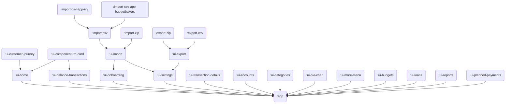

# Modularization

The goal of this file is to outline how we'll migrate Ivy Wallet from `app` monolith to `modularized` one.

**Motivation:**
- faster builds (only modules with changes will re-build)
- scaleability (create new features w/o affecting existing code)
- easier testing

## Modules Graph

_⚠️ WIP ⚠️_

